# Azure Secure Multi-Tier Infrastructure Deployment

## 📌 Project Overview
Designed and deployed a secure **2-tier Azure infrastructure** using a **Hub-and-Spoke architecture** to isolate workloads and enforce controlled access. A hardened **Jumpbox (bastion host)** acts as the only entry point, eliminating direct public exposure to backend systems and aligning with zero-trust security principles.

---

## 🏗️ Architecture Summary
- **Management Subnet (Hub):** Hosts Jumpbox for controlled administrative access  
- **Web Subnet (Spoke):** Hosts private Web Server with no public IP exposure  
- **Traffic Flow:** Internet → Jumpbox → Private Web Server  
- **Security Controls:** Network Security Groups (NSGs) and subnet segmentation  

---

## 🛠️ Implementation & Security Validation

### 1. Resource Inventory & Networking
Provisioned infrastructure and segmented virtual network configuration.

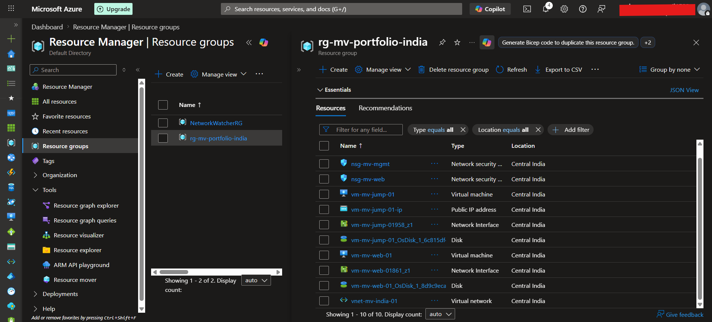
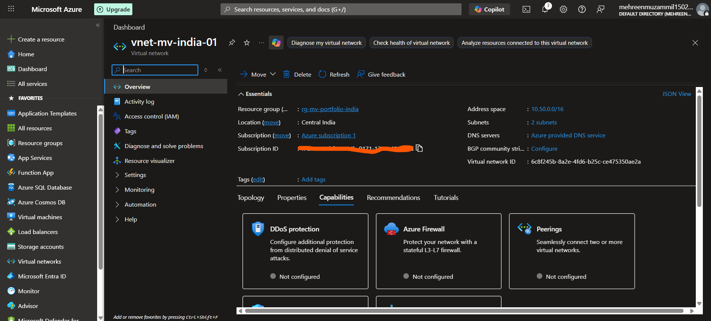
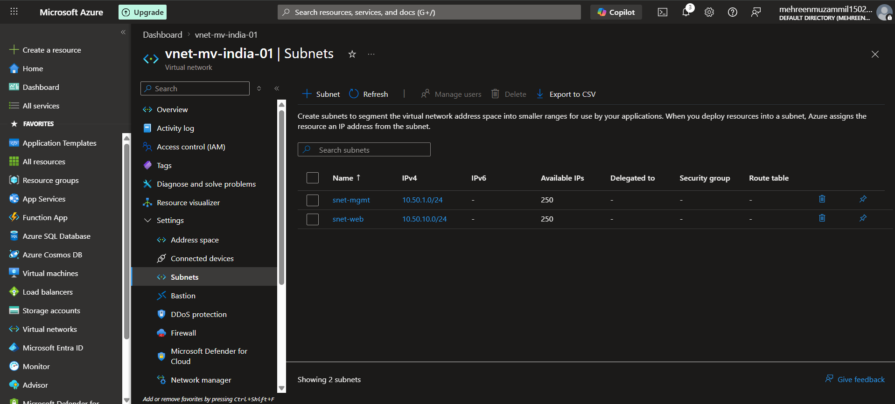

---

### 2. Tiered Security Controls (NSGs)
Implemented layered security policies to restrict access between tiers:

- **Management Tier (Jumpbox):** RDP restricted to authorized IP ranges only  
- **Web Tier (Private VM):** Allows traffic only from Management subnet; all public inbound denied  

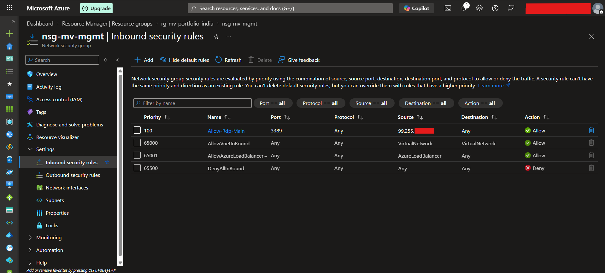
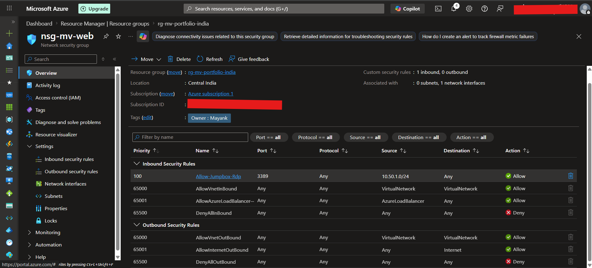

---

### 3. Compute Layer Configuration
Validated deployment of segmented virtual machines:

- **Jumpbox VM:** Public-facing administrative entry point  
- **Web Server VM:** Private IP only (10.50.10.4), isolated from internet  

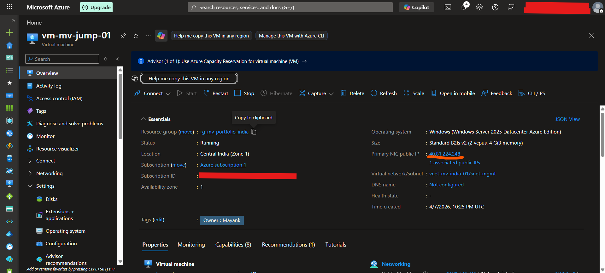
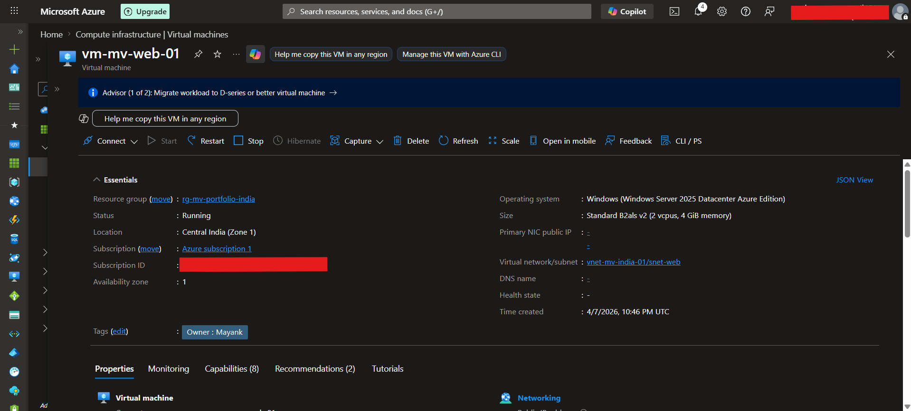

---

### 4. Secure Administrative Access Flow
Demonstrated controlled access using a jump-host model:

- External RDP access → Jumpbox  
- Internal RDP session → Private Web Server  

This ensures backend systems remain inaccessible from the public internet.

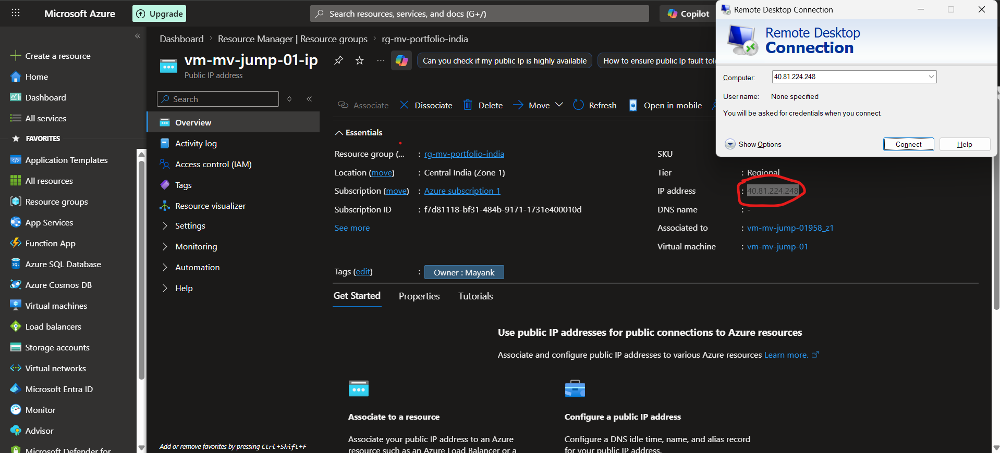
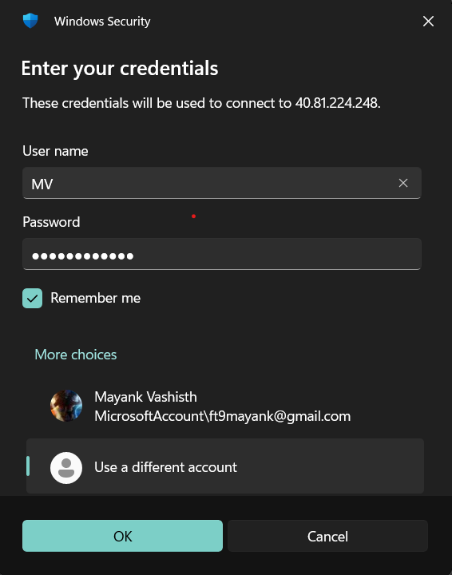
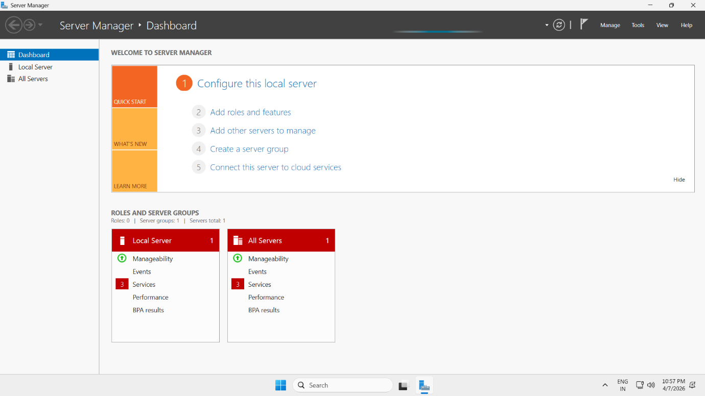
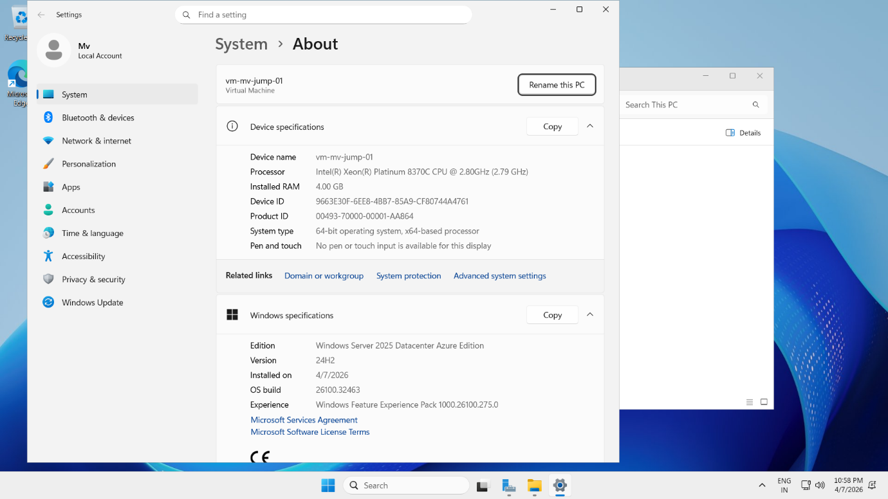
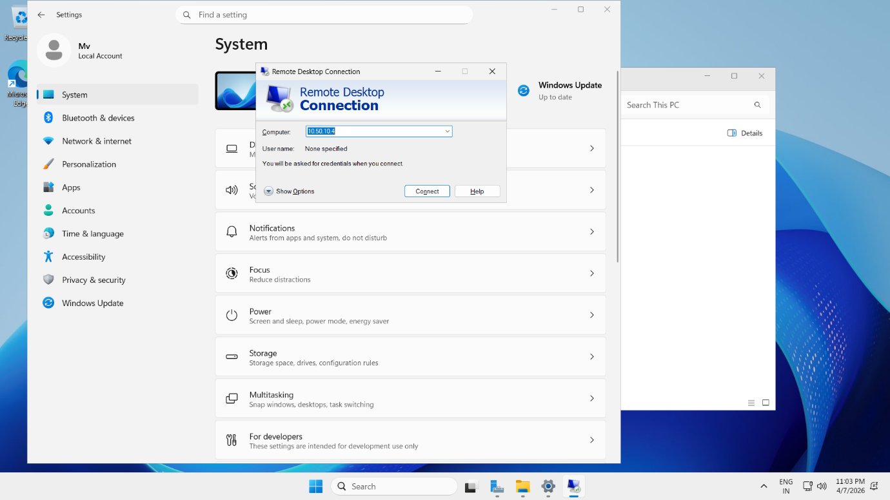
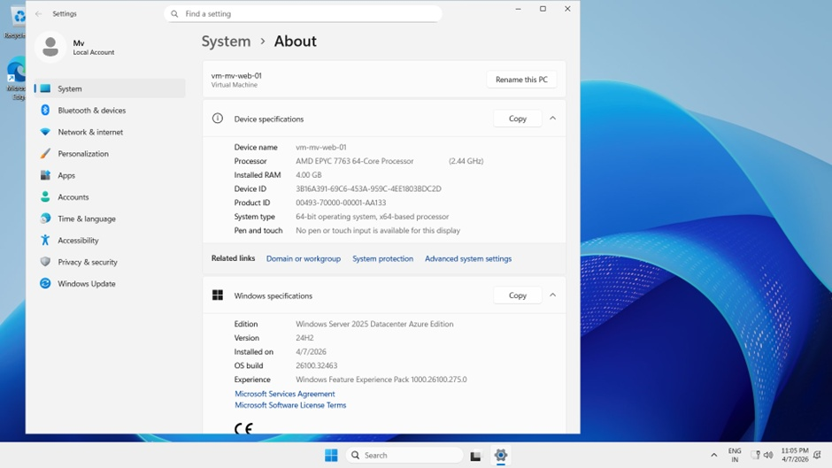

---

### 5. Service Deployment & Validation (IIS)
Installed and verified IIS web server functionality within the isolated network.

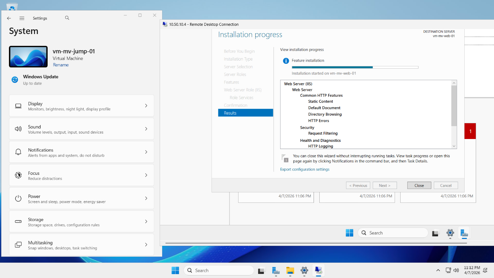
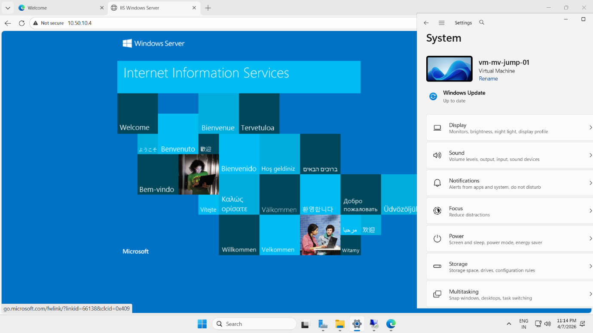

---

## 🛠️ Challenges & Troubleshooting
- VM connectivity issues due to restrictive NSG rules  
  → Resolved by adjusting rule priorities and validating subnet-level associations  

- Initial access issues between tiers  
  → Fixed by allowing required intra-network traffic  

---

## 🚀 Key Takeaways & Skills Demonstrated
- **Zero-Trust Architecture:** Eliminated direct public exposure of backend systems  
- **Network Security:** Implemented multi-tier NSG policies and subnet isolation  
- **Cloud Infrastructure:** Designed and deployed segmented Azure environments  
- **Access Control:** Enforced secure administrative access using jump-host pattern  
- **Troubleshooting:** Diagnosed and resolved real-world connectivity and security issues  
---

## 🚀 Key Takeaways & Skills
- **Zero-Trust Networking:** Isolated backend tiers from the public internet.
- **Security Engineering:** Implemented multi-tier NSG rules and Jumpbox patterns.
- **Cloud Administration:** Deployed Windows Server 2025 and IIS roles in a segmented environment.
